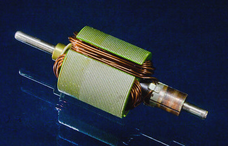

# Flat Coil

Remember your mini 4WD, or RC cars? They are often powered by an electric DC motor, and they usually look like this:

If you open the motor and take a look inside, you'll often see these components: brush, permanent magnets, and coil (brush might be absent on brushless DC motors).

Let's take a look at the coil:

DC Motor Armature 540 type” by Tudor Barker, CC BY-NC-SA 2.0 

When electric current flow within the wire in this component, it generates magnetic force. This is the base principle of electromagnet. In the case of DC motor, the electromagnet poles will interact with the permanent magnet poles and create rotational force. 

-to be continued-

